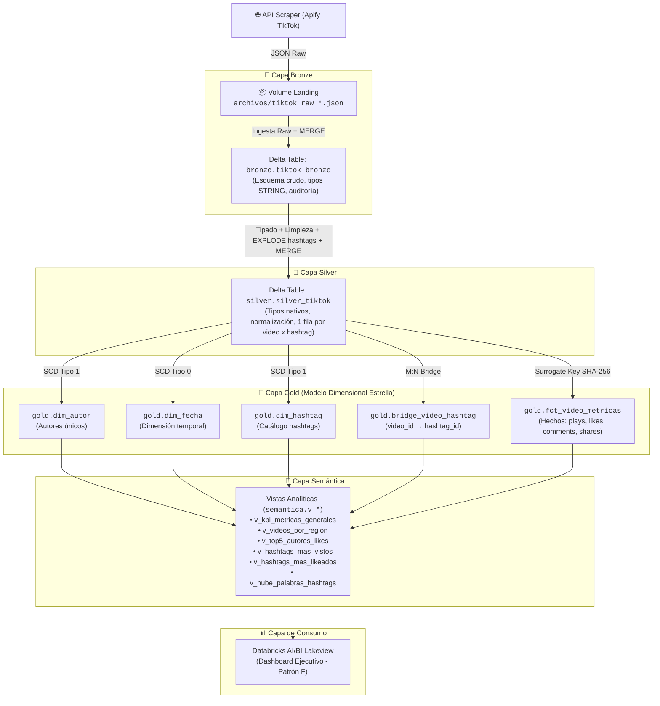

#  TikTok Data Engineering Pipeline — Medallion Lakehouse

[](https://databricks.com/)
[](https://delta.io/)
[](https://spark.apache.org/)
[](https://docs.databricks.com/data-governance/unity-catalog/)
[](https://databricks.com/product/databricks-sql)

---

## 1. ¿Qué hace?
> **Pipeline de ingeniería de datos end-to-end que extrae, transforma y modela contenido de TikTok en el nicho de Data Engineering para descubrir a los creadores líderes, la distribución geográfica de producción y los hashtags de mayor impacto y viralidad.**

---

## 2. ¿Cómo funciona?

El flujo implementa una **Arquitectura Medallion** respaldada por Unity Catalog, garantizando idempotencia en cada etapa mediante operaciones `MERGE` de Delta Lake:



---

## 3. ¿Qué tecnologías usa?

- **Plataforma Core:** Databricks Lakehouse Platform con Unity Catalog (`tiktok_data_eng`).
- **Motor de Cómputo:** Apache Spark (PySpark) y Databricks SQL Warehouse.
- **Almacenamiento y Rendimiento:** Delta Lake con transacciones ACID, compactación controlada (`OPTIMIZE`) para consolidación de archivos Parquet y aprovechamiento de Delta Cache en memoria (evitando sobre-ingeniería de particionado en bajo volumen).
- **Orquestación:** Databricks Workflows / Jobs (DAG con tareas concurrentes para dimensiones y secuencial para la tabla de hechos).
- **Modelado Dimensional:** Modelo Estrella (Kimball) con claves sustitutas hash determinísticas (`row_hash` con SHA-256).
- **Visualización:** Databricks AI/BI Dashboards (Lakeview) optimizado con Patrón F.

---

## 4. ¿Cómo lo corro?

### Prerrequisitos
1. Workspace de Databricks con Unity Catalog activo.
2. Catálogo `tiktok_data_eng` con esquemas: `landing`, `bronze`, `silver`, `gold`, `semantica`.
3. SQL Warehouse o clúster interactivo configurado.

### Paso a Paso

1. **Creación de Infraestructura y Tablas (DDL):**
   Ejecutar en orden los notebooks de `src/DDL/`:
   ```bash
   src/DDL/Bronze/DDL_bronze.ipynb
   src/DDL/Silver/DDL_silver.ipynb
   src/DDL/Gold/DDL_gold_dims.ipynb
   src/DDL/Gold/DDL_gold_bridge.ipynb
   src/DDL/Gold/DDL_gold_fact.ipynb
   ```

2. **Carga y Transformación de Datos (ETL):**
   Ejecutar los notebooks de `src/ETL/` o disparar el Job orquestado:
   - `src/ETL/Bronze/ETL_bronze.ipynb`
   - `src/ETL/Silver/ETL_silver.ipynb`
   - `src/ETL/Gold/` (ETL de dimensiones en paralelo + hecho fct_video_metricas)

3. **Capa Semántica y Vistas:**
   Ejecutar los notebooks en `src/VIEWS/` para instanciar las vistas `v_*` en el esquema `tiktok_data_eng.semantica`.

4. **Orquestación Automática (Databricks Workflow):**
   Ejecutar el Job `Pipeline_TikTok_Medallion_ETL`:
   ```mermaid
   graph LR
       T_Silver["ETL_Silver"] --> T_DimAutor["ETL_Dim_Autor"]
       T_Silver --> T_DimFecha["ETL_Dim_Fecha"]
       T_Silver --> T_DimHash["ETL_Dim_Hashtag"]
       T_Silver --> T_Bridge["ETL_Bridge_Hash"]
       T_DimAutor & T_DimFecha & T_DimHash & T_Bridge --> T_Fact["ETL_Fct_Metricas"]
   ```

---

## 5. ¿Qué resultados tiene?

### 📈 Métricas Clave del Dataset (Limpio y Filtrado — Nicho Ingeniería de Datos)
> *Se aplicó un doble criterio de calidad de datos en la capa Silver: (1) **Media Recortada (Trimmed Mean)** eliminando colas P05-P95 para mitigar outliers extremos, y (2) **Filtro de Relevancia Temática Positiva** enfocándose exclusivamente en búsquedas especializadas de ingeniería de datos para eliminar el sesgo de homonimia y ruido de entretenimiento.*

| Métrica | Valor Obtenido |
|---|---|
| **Total de Videos Analizados (Ingeniería de Datos)** | `775` videos únicos |
| **Total de Reproducciones Acumuladas** | `13,180,396` (~13.2 Millones) |
| **Total de Likes Acumulados** | `841,051` (~841 Mil) |
| **Media Recortada de Vistas por Video** | `17,007` reproducciones |
| **Media Recortada de Likes por Video** | `1,085` likes |

### 🛡️ Calidad de Datos: Eliminación del Sesgo de Homonimia (`#data`)
Durante la ingesta inicial en Bronze, la búsqueda general `#data` introdujo severo sesgo debido a su homonimia con el álbum musical *"DATA"* de Tainy y Bad Bunny (canciones virales como *Mojabi Ghost*), así como contenido genérico de noticias y crímenes que diluían el propósito del análisis.
- **Solución arquitectónica en Silver:** Se restringió la ingesta en Silver exclusivamente a los 5 términos especializados del nicho (`ingenieriadedatos`, `databricks`, `dataengineering`, `pyspark`, `dataengineer`). Esta regla positiva erradicó la necesidad de listas negras (`NOT IN`), garantizando un dataset 100% puro del ecosistema de Ingeniería de Datos.

### 🏆 Hallazgos Principales (Insights)
- **Top Creadores por Likes:** Liderado por figuras del ecosistema como `@masana.xx` (188K likes), `@nataliefratto` (95K likes), `@itssimplyjordan` (40K likes), la cuenta oficial de `@airbytehq` (37K likes, herramienta líder de integración de datos) y `@sergi.data` (35K likes).
- **Concentración Regional:** Perú (`PE` con 137 videos), México (`MX` con 114), Estados Unidos (`US` con 73), España (`ES` con 72) y Reino Unido (`GB` con 62) concentran la producción de contenido de ingeniería de datos.
- **Hashtags de Mayor Tracción:** `#dataengineer`, `#databricks`, `#dataengineering`, `#datascience`, `#sql` y `#dataanalytics` dominan la conversación comunitaria.

### 🖥️ Dashboard Ejecutivo (Patrón F)
- **Cabecera Horizontal Superior:** 4 Scorecards de KPIs clave (Totales y Promedios limpios).
- **Banda Intermedia:** Gráfico de barras del Top 5 de Regiones Geográficas (`PE`, `MX`, `US`, `ES`, `GB`).
- **Bloque Vertical Inferior:** Rankings de Autores, Hashtags con más vistas, Hashtags récord de likes y Nube de términos.
